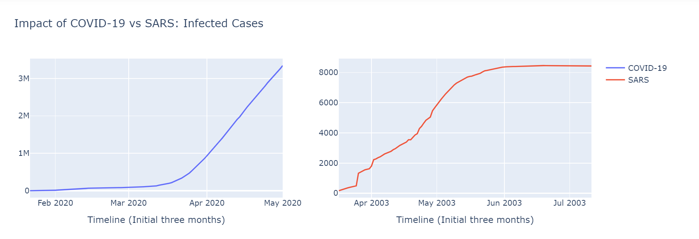
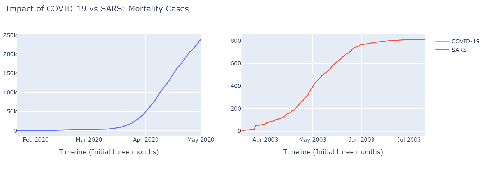
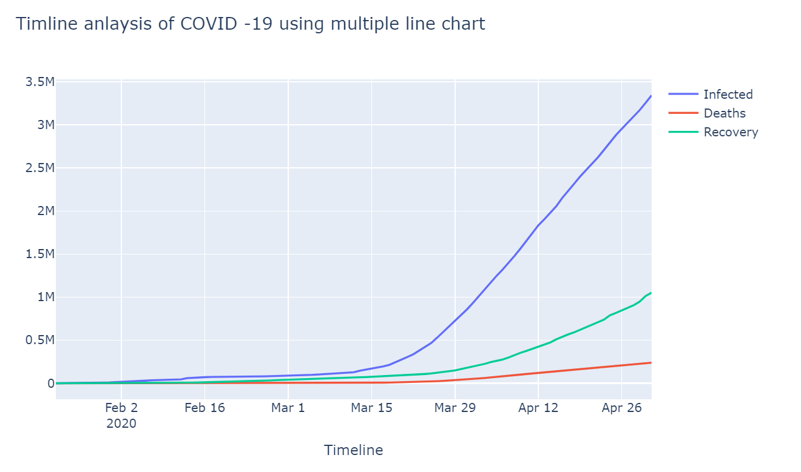
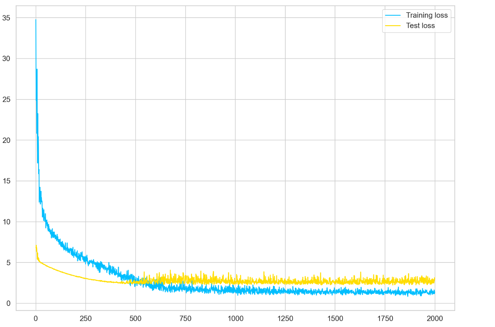
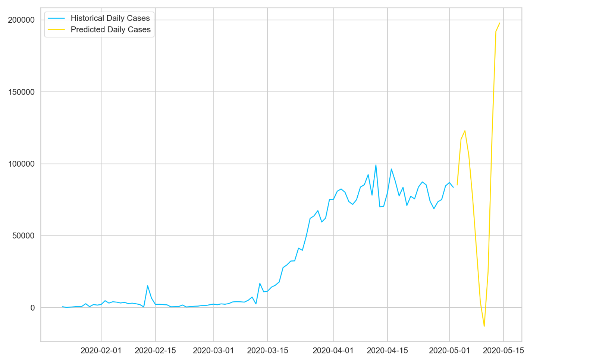

# COVID-19-Predictions-and-Visualizations
A repository for the visualization and prediction of COVID 19 cases in Pytorch from 22nd January 2020 to 2nd May 2020

Comparing Infected COVID Cases as at 2nd May 2020 with Infected SARS cases July 2003

Comparing Mortality rates for COVID-19 and SARS

Comparing Infected, Recovered and Mortality Cases of COVID-19

Scatter plot and Maps of COVID-19 World Cases 

# Pytorch Predictions of COVID-19

Train and Test Losses

Predicted Cases

